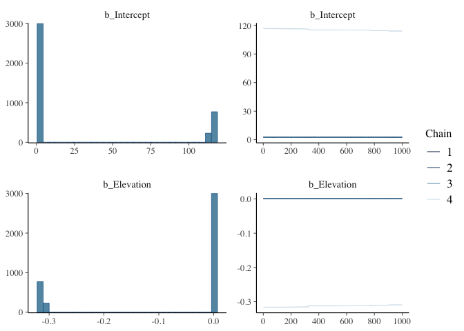
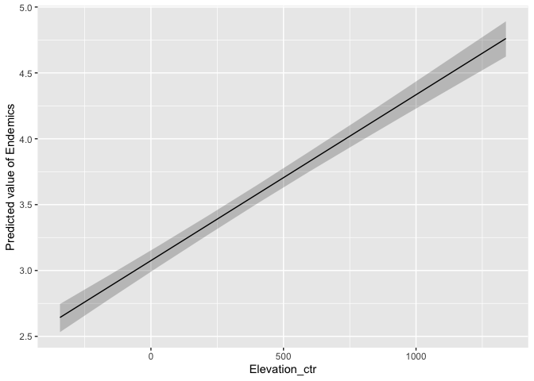
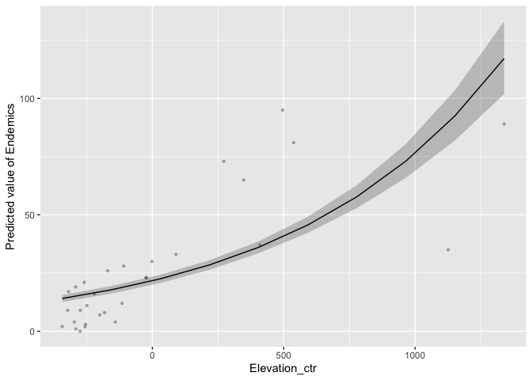
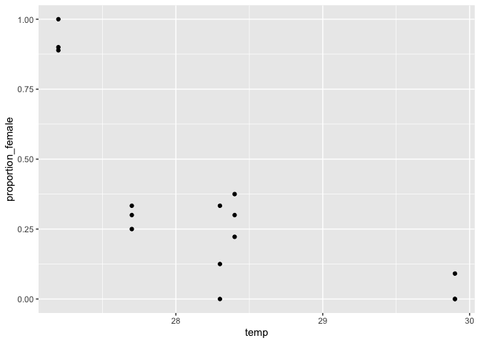
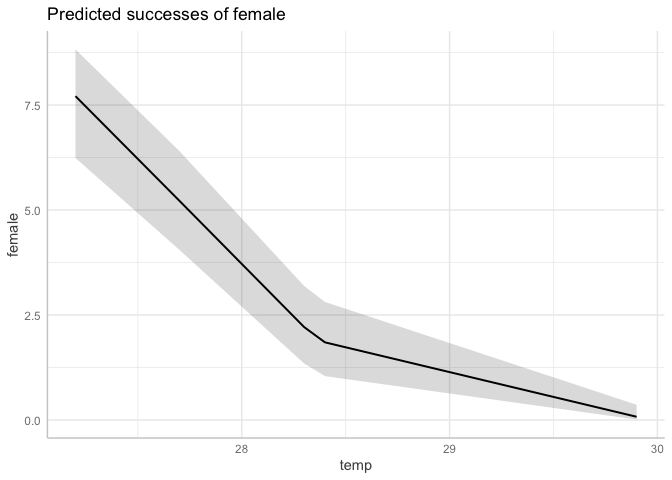
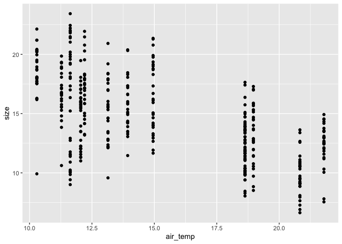
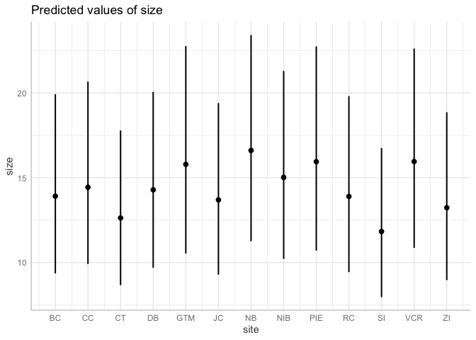

Activity 14: Statistical reasoning 6: generalized linear and multilevel
models
================

Welcome! This is the sixth statistical reasoning activity. The goals of
this activity are to understand how to implement and interpret both
generalized linear models and multilevel models. Specifically, you will:

- Learn to identify an appropriate distribution to use with data
- Implement and interpret generalized linear models, including
  understanding how to interpret results based on “link functions”
- Implement and interpret multilevel models by adding “random effects”
  to models

This is also the final activity of the class! Congratulations on making
it!!

------------------------------------------------------------------------

You will submit one output for this activity:

1.  A **PDF** of a rendered Quarto document with all of your R code.
    Please create a new Quarto document (e.g. don’t use this
    `README.qmd`) and include all of the code that appears in this
    document, your own code, and **answers to all of the questions** in
    the “Q#” sections. Submit this PDF through Gradescope.

A reminder: **Please label the code** in your final submission in two
ways:

1.  denote your answers to each question using headers that correspond
    to the question you’re answering, and
2.  thoroughly “comment” your code: remember, this means annotating your
    code directly by typing descriptions of what each line does after a
    `#`. This will help future you!

------------------------------------------------------------------------

# 1. Generalized linear models

------------------------------------------------------------------------

## 1.1 Introduction

Generalized linear models allow us to use different distributions that
reflect the reality of our response variables.

``` r
library(tidyverse) # For data wrangling
library(brms) # For stats
library(ggeffects) # for plotting model predictions
# Note: I needed to also install the `insight` and `see` packages to get `modelbased` to install properly; try that if you get similar error messages 
# install.packages('modelbased') # if you need to install this package
library(modelbased) # for plotting model predictions. supports the link scale (ggeffects does not)
# install.packages('faraway') # if you need to install this package
library(faraway) # For data on galapagos species richess
```

Let’s look at the (huge) variety of distribution families that are
available to use:

``` r
?brmsfamily
```

Thankfully, we are only going to use a couple today!

------------------------------------------------------------------------

### Conceptual practice

For Q1.1a and b, consider the following response variables:

1.  Counts of Clarkia flowers in a meadow
2.  Whether or not a female elephant seal gives birth
3.  The percent cover of red algae in the intertidal
4.  Growth of a tree from one year to the next
5.  The spatial area of a forest in square meters

------------------------------------------------------------------------

#### Q1.1a What values can each of the response variables take on?

Describe the type of values each of the variables can take on (e.g. real
numbers, negative real numbers, positive real numbers, zeroes, integers,
fractions, 0’s/1’s, etc.)

------------------------------------------------------------------------

#### Q1.1b Choose a distribution that fits each of the response variables

------------------------------------------------------------------------

#### Q1.2 Choose a distribution that fits your final project response variable

Now, 1. Write the response variable that you are using for your final
project. 2. What values can your response variable take on? (e.g. real
numbers, negative real numbers, positive real numbers, zeroes, integers,
fractions, 0’s/1’s, etc.) 3. What distribution (or distributions) fits
your response variable?

------------------------------------------------------------------------

In this next section, we are going to practice running generalized
linear models using distributions with two common link functions:
Poisson distribution (with a log link) and Bernoulli distribution with a
logit link.

------------------------------------------------------------------------

## 1.2 GLM with a log link

### Explore the data

We’re going to use plant species richness data from the Galapagos
islands. Species richness is simply the number of species that are found
in a sample - in this case, on a given island.

``` r
# Read in the pre-stored data
data("gala")
# Check out the first 6 rows
head(gala)
```

                 Species Endemics  Area Elevation Nearest Scruz Adjacent
    Baltra            58       23 25.09       346     0.6   0.6     1.84
    Bartolome         31       21  1.24       109     0.6  26.3   572.33
    Caldwell           3        3  0.21       114     2.8  58.7     0.78
    Champion          25        9  0.10        46     1.9  47.4     0.18
    Coamano            2        1  0.05        77     1.9   1.9   903.82
    Daphne.Major      18       11  0.34       119     8.0   8.0     1.84

``` r
# Look at the help page too!
```

More topographic heterogeneity often creates a larger number of
ecological niches in which species can specialize, and topography can
also facilitate species divergence. These processes might be at work on
the Galapagos. Let’s ask the question: *Does the highest elevation of an
island influence the number of endemic plant species?*

------------------------------------------------------------------------

#### Q1.3 Plot a histogram of the response variable `Endemics`

Plot a histogram or density plot of the response variable `Endemics` to
see how it is distributed. Does it look like a normal (Gaussian)
distribution, which is a nice, symmetrical distribution that can take
any value, or does it have certain constraints? What are those
constraints?

------------------------------------------------------------------------

#### Q1.4 Plot Endemics \~ Elevation

Make a plot to visualize the model we are about to run: Endemics as a
function of Elevation.

------------------------------------------------------------------------

### Run the model

Since these are integer counts and always positive, these data are
probably not suitable for a normal (aka Gaussian) distribution. Instead,
we are going to use a **Poisson distribution**. This distribution often
uses a log link function.

Thankfully, this is very simple to run in R!

``` r
# Endemics ~ Elevation
m.elev <- 
  brm(data = gala, # Give the model the penguins data
      # Choose a poisson distribution - THIS IS THE NEW PART!
      family = poisson(link = "log"),
      # Specify the model here. 
      Endemics ~ 1 + Elevation,
      # Here's where you specify parameters for executing the Markov chains
      # We're using similar to the defaults, except we set cores to 4 so the analysis runs faster than the default of 1
      iter = 2000, warmup = 1000, chains = 4, cores = 4,
      # Save the fitted model object as output - helpful for reloading in the output later
      file = "output/m.elev")
```

And let’s check out the summary:

``` r
plot(m.elev)
```



``` r
pairs(m.elev)
```


``` r
summary(m.elev)
```

     Family: poisson 
      Links: mu = log 
    Formula: Endemics ~ 1 + Elevation 
       Data: gala (Number of observations: 30) 
      Draws: 4 chains, each with iter = 2000; warmup = 1000; thin = 1;
             total post-warmup draws = 4000

    Regression Coefficients:
              Estimate Est.Error l-95% CI u-95% CI Rhat Bulk_ESS Tail_ESS
    Intercept    30.80     48.84     2.51   116.49 1.60        7       11
    Elevation    -0.08      0.14    -0.32     0.00 1.59        7       11

    Draws were sampled using sampling(NUTS). For each parameter, Bulk_ESS
    and Tail_ESS are effective sample size measures, and Rhat is the potential
    scale reduction factor on split chains (at convergence, Rhat = 1).

------------------------------------------------------------------------

#### Q1.5 Evaluate the output

Look at the plots and the summary, then please explain what you have
learned. Has the model fitting algorithm converged? If no, how do you
know? If yes, what have you learned about elevation and richness?

------------------------------------------------------------------------

#### Q1.6 Center the predictors

To fix convergence issues, it helps to center the predictors, increase
the iterations and warmups, and set some priors. Please 1) center
Elevation by creating a new column, `Elevation_ctr`, that subtracts each
value in the `Elevation` column by the mean value (hint:
`Elevation - mean(Elevation)`), 2) change the brm chain arguments to
iter=6000, warmup=4000, 3) add some priors that seem reasonable, and 4)
re-fit the model. Please call the new model m.elev2, then use plot(),
summary(), and pairs() on it. This is a lot on your own, but you can do
it! And we’re here to help.

Remember, the model output rounds to two decimal places, so if the
values are smaller than two decimal places, you can replace
`summary(model)` with `print(model, digits = 4)`.

### Plot the posterior

Before we get into interpreting the GLM output, let’s plot the posterior
prediction on the measurement scale using the `estimate_expectation()`
function from the `modelbased` package.

``` r
preds <- estimate_expectation(m.elev2, by = 'Elevation_ctr')
plot(preds, show_data = TRUE)
```


Remember how we have a log link? What that means is that the model ran a
linear model on the **logged** values of our response, `Endemics`. So
the output that we get from the model is reporting the values of our
slope, intercept, etc on the log scale.

The `predict_response()` function by default back-transforms from the
log scale (log(`Endemics`)) of the linear model to the measurement scale
of `Endemics`; that’s what you see above. To see the linear model on the
log scale, however, we can set predict = ‘link’:

``` r
predslog <- estimate_expectation(m.elev2, by = 'Elevation_ctr', predict = 'link')
plot(predslog)
```



------------------------------------------------------------------------

### Interpreting link scale coefficients

This difference in how the model reports coefficients is very important
for how we interpret the `summary()` output, especially if we want to
make it biologically meaningful. Let’s revisit the summary:

``` r
print(m.elev2, digits = 4)
```

     Family: poisson 
      Links: mu = log 
    Formula: Endemics ~ 1 + Elevation_ctr 
       Data: gala (Number of observations: 30) 
      Draws: 4 chains, each with iter = 6000; warmup = 4000; thin = 1;
             total post-warmup draws = 8000

    Regression Coefficients:
                  Estimate Est.Error l-95% CI u-95% CI   Rhat Bulk_ESS Tail_ESS
    Intercept       3.0751    0.0412   2.9910   3.1525 1.0036     1177     1177
    Elevation_ctr   0.0013    0.0001   0.0011   0.0014 1.0003     3401     4284

    Draws were sampled using sampling(NUTS). For each parameter, Bulk_ESS
    and Tail_ESS are effective sample size measures, and Rhat is the potential
    scale reduction factor on split chains (at convergence, Rhat = 1).

Normally, we would look at the estimate of `Elevation_ctr` (0.0013 for
my model) and say that “for every one meter of Elevation, we have an
increase in 0.0013 endemic species”. However, this is on the log scale,
which means that “for every one meter of Elevation, we have an increase
in 0.0013 log(endemic species)”. This is the linear slope that we see
when we plot the
`estimate_expectation(m.elev2, by = 'Elevation_ctr', predict = 'link')`.

We want things on the “response” aka “measurement” scale, though, which
is in the units that we care about (# of species). To back-transform
this and interpret it properly, we need to do two things:

1.  Back transform the value using the inverse of the link function - in
    this case, we exponentiate it, since exponentiating is the inverse
    of logging

2.  Interpret the result on a multiplicative scale

3.  **Backtransform:**

My slope value is 0.0013, so I will take the `exp()` of that value:

``` r
exp(0.0013)
```

    [1] 1.001301

This back transforms to 1.0013

2.  **Interpret:**

This value of 1.0013 does NOT mean that for every 1m of elevation, you
get an increase 1.0013 species. Because it is a log scale specifically,
our response variable is increasing exponentially with our predictor,
like in the graph we made above and copied below. The correct way to
interpret this value is multiplicatively: *for every 1m of elevation,
you get an increase in 1.0013 times as many species as the previous
meter.*

``` r
plot(preds, show_data = TRUE)
```



A nice way to think about this is percent increase in species per meter.
If your back-transformed slope is 1.00, you have no change: for every 1m
of elevation, you get 1x as many species, which is exactly the same
number as before. If you had a back-transformed value of 1.01, you would
have 1.01x as many species, or a `(1.01 - 1.00)*100 = 1%` increase in
species per meter of elevation. If you got a back-transformed slope
value of 0.5, then for every m of elevation, you would have
`(0.5 - 1.0)*100 = -50%` change, or a 50% decline in number of species
per m of elevation

This can be confusing since it’s a whole new way to interpret these
values. Thankfully, a lot of distributions use log link scales, so you
can implement this method quite often.

------------------------------------------------------------------------

#### Q1.7 What is the percent change on the response scale?

Let’s get some quick practice with back-transforming values. Here are
three slope estimates on the *log link* scale. Using the method above,
back-transform these slopes to the response (measurement) scale and
report the percent change using the units provided:

1.  Number of Clarkias blooming as a function of temperature in Celsius:
    1.09
2.  Density of sea urchins per square meter in a quadrat as a function
    of number of sea otters: -2.5
3.  Number of tomatoes per plant as a function of kg of fertilizer: 6.24

------------------------------------------------------------------------

How can we tell whether or not our slope is different from zero? We can
simply go back to the default summary() output, which is on the link
scale (log scale in this case) and see whether zero is consistent with
the slope, as usual. In this case, my 95% CIs go from 0.0011 to 0.0014,
so I am quite confident that a zero slope value is not consistent with
this model and data.

------------------------------------------------------------------------

### DIY: Run a model of non-endemic species \~ distance from Santa Cruz Island

Santa Cruz Island in the Galapagos is the most populated and “touristy”
island, while others are more remote. We might predict that non-native
species are more common closer to Santa Cruz Island and rarer farther
from the island. There’s not a specific “non-native species” column, but
we can subtract the number of endemic species from the total number of
species to get a general idea of non-endemic species.

#### Q1.8 Create a non-endemic column

Using what you learned in past lessons, create a new column that is the
number of non-endemic species (call it `non_Endemics`). Then, create a
scatterplot of the number of non-endemic species on the y-axis with the
distance from Santa Cruz Island (km) `Scruz` on the x-axis.

------------------------------------------------------------------------

#### Q1.9 Run a model of non Endemics \~ distance from Santa Cruz Island

Run a model with a Poisson distribution and log-link function that
models the number of non-endemic species as a function of distance from
Santa Cruz Island.

------------------------------------------------------------------------

#### Q1.10 Evaluate the output

Assess whether the model ran correctly by looking at R hat, the chains,
and the posterior distributions. Describe your thought process about
whether the model ran correctly in 1-2 sentences.

------------------------------------------------------------------------

#### Q1.11 Interpret the output

Interpret the model coefficients by writing a 2-3 sentence results
paragraph that answers:

1.  What is the effect of distance from Santa Cruz Island on number of
    non-endemic species? Report the a) original output on the log
    scale, b) your backtransformed value, and c) the percent change that
    this translates to. Describe the effect using the proper units.
2.  Does it seem like the slope estimate is different from zero? Why?

------------------------------------------------------------------------

#### Q1.12 Plot the posterior

Plot the model predictions, first on the log link scale, then on the
response scale. Please show the data in your plot on the response scale.

------------------------------------------------------------------------

## 1.3 GLM with a logit link

### Bring in turtle data

In some species, incubation temperature of eggs affects the sex ratio of
males vs females at birth. This dataset, from the `faraway` package, has
the number of male and female turtles hatched at different temperatures.
Let’s calculate the total hatched and the proportion female:

``` r
turtle <- faraway::turtle %>% 
  mutate(total_turtles = male + female,
         proportion_female = female/total_turtles)
```

And let’s plot it!

``` r
turtle %>% 
  ggplot(aes(x = temp, y = proportion_female)) +
  geom_point()
```



------------------------------------------------------------------------

### Run model

Since these are proportion data, a binomial link is the right choice of
distribution to use. Let’s fit a model. In this case, we need to specify
our integer value of “successes” that we are interested in modeling
while also including the number of “trials”. In this case, “trials” are
the total number of turtles while “successes” are the total number of
females.

``` r
m.turt <- 
  brm(data = turtle, # Give the model the data
      # Choose a binomial distribution - THIS IS THE NEW PART!
      family = binomial(link = "logit"),
      # Specify the model here. 
      female | trials(total_turtles) ~ 1 + temp,
      # Here's where you specify parameters for executing the Markov chains
      # We're using similar to the defaults, except we set cores to 4 so the analysis runs faster than the default of 1
      iter = 4000, warmup = 1000, chains = 4, cores = 4,
      # Save the fitted model object as output - helpful for reloading in the output later
      file = "output/m.turt")
```

    Running /Library/Frameworks/R.framework/Resources/bin/R CMD SHLIB foo.c
    using C compiler: ‘Apple clang version 12.0.5 (clang-1205.0.22.9)’
    using SDK: ‘MacOSX11.3.sdk’
    clang -arch arm64 -I"/Library/Frameworks/R.framework/Resources/include" -DNDEBUG   -I"/Library/Frameworks/R.framework/Versions/4.4-arm64/Resources/library/Rcpp/include/"  -I"/Library/Frameworks/R.framework/Versions/4.4-arm64/Resources/library/RcppEigen/include/"  -I"/Library/Frameworks/R.framework/Versions/4.4-arm64/Resources/library/RcppEigen/include/unsupported"  -I"/Library/Frameworks/R.framework/Versions/4.4-arm64/Resources/library/BH/include" -I"/Library/Frameworks/R.framework/Versions/4.4-arm64/Resources/library/StanHeaders/include/src/"  -I"/Library/Frameworks/R.framework/Versions/4.4-arm64/Resources/library/StanHeaders/include/"  -I"/Library/Frameworks/R.framework/Versions/4.4-arm64/Resources/library/RcppParallel/include/"  -I"/Library/Frameworks/R.framework/Versions/4.4-arm64/Resources/library/rstan/include" -DEIGEN_NO_DEBUG  -DBOOST_DISABLE_ASSERTS  -DBOOST_PENDING_INTEGER_LOG2_HPP  -DSTAN_THREADS  -DUSE_STANC3 -DSTRICT_R_HEADERS  -DBOOST_PHOENIX_NO_VARIADIC_EXPRESSION  -D_HAS_AUTO_PTR_ETC=0  -include '/Library/Frameworks/R.framework/Versions/4.4-arm64/Resources/library/StanHeaders/include/stan/math/prim/fun/Eigen.hpp'  -D_REENTRANT -DRCPP_PARALLEL_USE_TBB=1   -I/opt/R/arm64/include    -fPIC  -falign-functions=64 -Wall -g -O2  -c foo.c -o foo.o
    In file included from <built-in>:1:
    In file included from /Library/Frameworks/R.framework/Versions/4.4-arm64/Resources/library/StanHeaders/include/stan/math/prim/fun/Eigen.hpp:22:
    In file included from /Library/Frameworks/R.framework/Versions/4.4-arm64/Resources/library/RcppEigen/include/Eigen/Dense:1:
    In file included from /Library/Frameworks/R.framework/Versions/4.4-arm64/Resources/library/RcppEigen/include/Eigen/Core:19:
    /Library/Frameworks/R.framework/Versions/4.4-arm64/Resources/library/RcppEigen/include/Eigen/src/Core/util/Macros.h:679:10: fatal error: 'cmath' file not found
    #include <cmath>
             ^~~~~~~
    1 error generated.
    make: *** [foo.o] Error 1

``` r
summary(m.turt)
```

     Family: binomial 
      Links: mu = logit 
    Formula: female | trials(total_turtles) ~ 1 + temp 
       Data: turtle (Number of observations: 15) 
      Draws: 4 chains, each with iter = 4000; warmup = 1000; thin = 1;
             total post-warmup draws = 12000

    Regression Coefficients:
              Estimate Est.Error l-95% CI u-95% CI Rhat Bulk_ESS Tail_ESS
    Intercept    62.95     12.02    40.97    87.99 1.00     4405     5317
    temp         -2.27      0.43    -3.16    -1.48 1.00     4350     5141

    Draws were sampled using sampling(NUTS). For each parameter, Bulk_ESS
    and Tail_ESS are effective sample size measures, and Rhat is the potential
    scale reduction factor on split chains (at convergence, Rhat = 1).
    000 [ 45%]  (Sampling)
    Chain 4: Iteration:  800 / 4000 [ 20%]  (Warmup)
    Chain 3: Iteration: 1400 / 4000 [ 35%]  (Sampling)
    Chain 1: Iteration: 2600 / 4000 [ 65%]  (Sampling)
    Chain 4: Iteration: 1001 / 4000 [ 25%]  (Sampling)
    Chain 2: Iteration: 2200 / 4000 [ 55%]  (Sampling)
    Chain 1: Iteration: 3000 / 4000 [ 75%]  (Sampling)
    Chain 3: Iteration: 1800 / 4000 [ 45%]  (Sampling)
    Chain 4: Iteration: 1400 / 4000 [ 35%]  (Sampling)
    Chain 2: Iteration: 2600 / 4000 [ 65%]  (Sampling)
    Chain 1: Iteration: 3400 / 4000 [ 85%]  (Sampling)
    Chain 3: Iteration: 2200 / 4000 [ 55%]  (Sampling)
    Chain 4: Iteration: 1800 / 4000 [ 45%]  (Sampling)
    Chain 2: Iteration: 3000 / 4000 [ 75%]  (Sampling)
    Chain 1: Iteration: 3800 / 4000 [ 95%]  (Sampling)
    Chain 3: Iteration: 2600 / 4000 [ 65%]  (Sampling)
    Chain 1: Iteration: 4000 / 4000 [100%]  (Sampling)
    Chain 1: 
    Chain 1:  Elapsed Time: 0.014 seconds (Warm-up)
    Chain 1:                0.038 seconds (Sampling)
    Chain 1:                0.052 seconds (Total)
    Chain 1: 
    Chain 4: Iteration: 2200 / 4000 [ 55%]  (Sampling)
    Chain 2: Iteration: 3400 / 4000 [ 85%]  (Sampling)
    Chain 3: Iteration: 3000 / 4000 [ 75%]  (Sampling)
    Chain 4: Iteration: 2600 / 4000 [ 65%]  (Sampling)
    Chain 2: Iteration: 3800 / 4000 [ 95%]  (Sampling)
    Chain 3: Iteration: 3400 / 4000 [ 85%]  (Sampling)
    Chain 2: Iteration: 4000 / 4000 [100%]  (Sampling)
    Chain 2: 
    Chain 2:  Elapsed Time: 0.014 seconds (Warm-up)
    Chain 2:                0.039 seconds (Sampling)
    Chain 2:                0.053 seconds (Total)
    Chain 2: 
    Chain 4: Iteration: 3000 / 4000 [ 75%]  (Sampling)
    Chain 3: Iteration: 3800 / 4000 [ 95%]  (Sampling)
    Chain 3: Iteration: 4000 / 4000 [100%]  (Sampling)
    Chain 3: 
    Chain 3:  Elapsed Time: 0.014 seconds (Warm-up)
    Chain 3:                0.04 seconds (Sampling)
    Chain 3:                0.054 seconds (Total)
    Chain 3: 
    Chain 4: Iteration: 3400 / 4000 [ 85%]  (Sampling)
    Chain 4: Iteration: 3800 / 4000 [ 95%]  (Sampling)
    Chain 4: Iteration: 4000 / 4000 [100%]  (Sampling)
    Chain 4: 
    Chain 4:  Elapsed Time: 0.014 seconds (Warm-up)
    Chain 4:                0.042 seconds (Sampling)
    Chain 4:                0.056 seconds (Total)
    Chain 4: 

------------------------------------------------------------------------

### Interpret model and plot predictions

According to this model, temperature reduces the probability that a
turtle will be female by 2.27 on the logit scale per degree Celsius.
This is tricky to get into the response scale, so we won’t get into that
now! Here’s some slightly janky code that shows, based on this model,
the predicted number of females as a function of temperature. It’s
standardized at 10 trials, aka 10 total turtles, so a value of 9 means 9
out of 10 turtles are female, and thus there’s a 90% probability of
being female.

``` r
pred <- predict_response(m.turt, condition = c(total_turtles = 10))

plot(pred)
```



We can help more if your data is binomial or Bernoulli distributed for
your final project!

------------------------------------------------------------------------

------------------------------------------------------------------------

# 2. Multilevel models

------------------------------------------------------------------------

Much of the data in ecological and evolutionary biology is clustered in
some way. This clustering can be spatial, with some replicate
measurements being taken closer to one another than others, such as
conducting 10 transects at one site and another 10 transects and a
different site. It can temporal, where a bunch of measurements are
closer together in time compared to others, such as all within the same
season. A single individual, such as with large, well-studied marine
mammals, or test subjects in a lab, may be sampled multiple times. There
are many other examples!

If we’re not careful, we may incorrectly assume that all measurements
are independent of one another, where in reality, the measurements that
are closer together in space, time, etc, are likely more closely related
to one another than to other measurements. Using multi-level models (aka
mixed effects models, hierarchical models) can fix this and improve our
estimates of our parameters.

For some simple terminology: in multi-level models our predictor
variables can be either *fixed effects* or *random effects*

- Fixed effects are the variables we care about getting a parameter
  estimate from, like a slope value of how x affects y. **Every model we
  have run so far has used exclusively fixed effects**
- Random effects are the variables that contribute to clustering in our
  data. They are many coefficients of the same type, and so we can help
  the model learn about them as a set.
- Sometimes, a variable can be treated as either a random or a fixed
  effect.

------------------------------------------------------------------------

### Conceptual practice

#### Q2.1 Fixed effects vs random effects

For the following variables in the model examples below, denote which
variables are the fixed effects and which could be accounted for as
random effects (some variables could be either, but consider then as
being eligible to be random effects):

1.  Student high school graduation rates as a function of: parental
    income, state of residence, and school district
2.  Density of kelp as a function of: latitude, site, transect number,
    and density of sea urchins
3.  Probability of whale giving birth as a function of: age, annual
    temperature, year, individual ID

------------------------------------------------------------------------

### Incorporate random effects

Let’s go back to fiddler crabs and revisit the relationship between
`air_temp` and crab `size`:

``` r
pie_crab <- lterdatasampler::pie_crab %>% 
  mutate(site = as.factor(site))
```

``` r
pie_crab %>% 
  ggplot(aes(x = air_temp, y = size)) +
  geom_point()
```



------------------------------------------------------------------------

This data is an excellent candidate for incorporating random effects.
The researchers measured \~30 crab sizes per site across 13 different
sites. Crabs that come from the same site are more similar to one
another than to crabs at different sites by virtue of spatial proximity;
there may be factors at play at the site level that are influence crab
size that we want to account for in our model of `size ~ water_temp`. As
you can see in the graph, there is very clear clustering of data points
at certain x-axis values because those crabs share the same site that
belongs to that x-axis value.

Let’s run the crab model without the random effect of site first. Let’s
also use a gamma distribution, since size is a positive continuous
variable.

``` r
m.watertemp <- 
  brm(data = pie_crab, # Give the model the penguins data
      # Use a gamma distribution
      family = Gamma(link = "log"),
      # Specify the model here. 
      size ~ 1 + water_temp,
      # Here's where you specify parameters for executing the Markov chains
      # We're using similar to the defaults, except we set cores to 4 so the analysis runs faster than the default of 1
      iter = 2000, warmup = 1000, chains = 4, cores = 4,
      # Save the fitted model object as output - helpful for reloading in the output later
      file = "output/m.watertemp")

print(m.watertemp, digits = 3)
```

     Family: gamma 
      Links: mu = log 
    Formula: size ~ 1 + water_temp 
       Data: pie_crab (Number of observations: 392) 
      Draws: 4 chains, each with iter = 2000; warmup = 1000; thin = 1;
             total post-warmup draws = 4000

    Regression Coefficients:
               Estimate Est.Error l-95% CI u-95% CI  Rhat Bulk_ESS Tail_ESS
    Intercept     3.355     0.056    3.246    3.466 1.001     4572     3150
    water_temp   -0.038     0.003   -0.044   -0.032 1.000     4858     3138

    Further Distributional Parameters:
          Estimate Est.Error l-95% CI u-95% CI  Rhat Bulk_ESS Tail_ESS
    shape   23.325     1.665   20.174   26.621 1.002     2803     2822

    Draws were sampled using sampling(NUTS). For each parameter, Bulk_ESS
    and Tail_ESS are effective sample size measures, and Rhat is the potential
    scale reduction factor on split chains (at convergence, Rhat = 1).

Now let’s incorporate site as a random effect:

``` r
m.watertemp.site <- 
  brm(data = pie_crab, # Give the model the penguins data
      # Use a gamma distribution
      family = Gamma(link = "log"),
      # Specify the model here. 
      size ~ 1 + water_temp + (1|site),
      # Here's where you specify parameters for executing the Markov chains
      # We're using similar to the defaults, except we set cores to 4 so the analysis runs faster than the default of 1
      iter = 2000, warmup = 1000, chains = 4, cores = 4,
      # Save the fitted model object as output - helpful for reloading in the output later
      file = "output/m.watertemp.site")

print(m.watertemp.site, digits = 3)
```

     Family: gamma 
      Links: mu = log 
    Formula: size ~ 1 + water_temp + (1 | site) 
       Data: pie_crab (Number of observations: 392) 
      Draws: 4 chains, each with iter = 2000; warmup = 1000; thin = 1;
             total post-warmup draws = 4000

    Multilevel Hyperparameters:
    ~site (Number of levels: 13) 
                  Estimate Est.Error l-95% CI u-95% CI  Rhat Bulk_ESS Tail_ESS
    sd(Intercept)    0.126     0.037    0.077    0.222 1.002      905     1100

    Regression Coefficients:
               Estimate Est.Error l-95% CI u-95% CI  Rhat Bulk_ESS Tail_ESS
    Intercept     3.364     0.196    2.977    3.760 1.002     1028     1486
    water_temp   -0.039     0.011   -0.061   -0.017 1.001     1101     1612

    Further Distributional Parameters:
          Estimate Est.Error l-95% CI u-95% CI  Rhat Bulk_ESS Tail_ESS
    shape   30.132     2.208   26.004   34.593 1.001     2896     2345

    Draws were sampled using sampling(NUTS). For each parameter, Bulk_ESS
    and Tail_ESS are effective sample size measures, and Rhat is the potential
    scale reduction factor on split chains (at convergence, Rhat = 1).

------------------------------------------------------------------------

#### Q2.2 What is the effect of water_temp on crab size on the response scale?

Interpret the output by writing a 2-3 sentence results paragraph that
answers:

1.  What is the effect of water_temp on creab size? Report the a)
    original output on the log scale, b) your backtransformed value,
    and c) the percent change that this translates to. Describe the
    effect using the proper units.
2.  Does it seem like the slope estimate is different from zero? Why?

------------------------------------------------------------------------

#### Q2.3 Compare WAIC and PSIS of the two models

Between the two models, which has the better predictive power?

------------------------------------------------------------------------

### Predict response of random effects

From the lecture, here’s some code about how to show variation around
each level of each random effect:

``` r
preds <- predict_response(m.watertemp.site,
                          interval = "prediction",
                          terms = "site",
                          type = "random")

plot(preds)
```



------------------------------------------------------------------------

Congrats on finishing your final in-class activity!!!

------------------------------------------------------------------------

### Render to PDF

When you have finished, remember to pull, stage, commit, and push with
GitHub:

- Pull to check for updates to the remote branch
- Stage your edits (after saving your document!) by checking the
  documents you’d like to push
- Commit your changes with a commit message
- Push your changes to the remote branch

Then submit the well-labeled PDF on Gradescope. Thanks!
